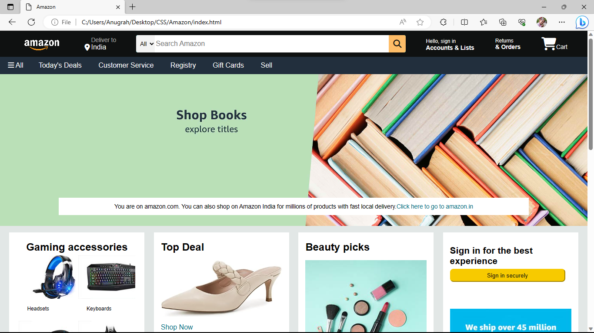
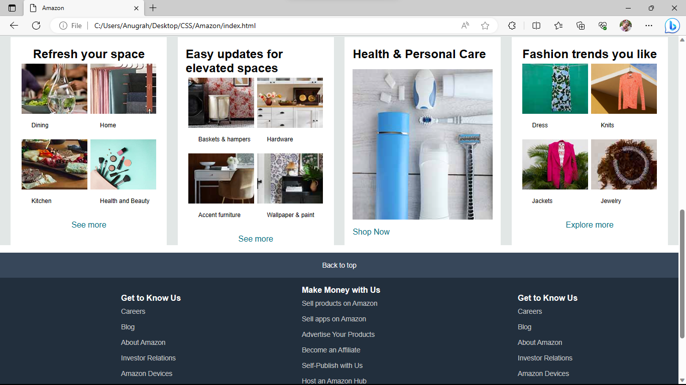
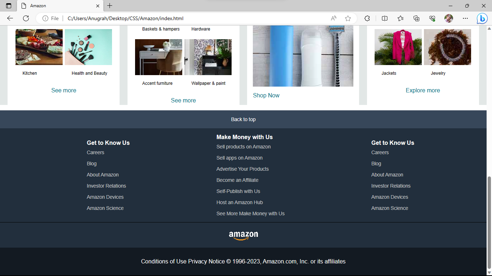

# [Amazon Clone Using HTML and CSS](https://anugrahprathap.github.io/AmazonClone/)

This is a simple Amazon clone created using HTML and CSS. It serves as a basic representation of the Amazon website layout and design, showcasing a header, hero section, various content boxes, and a footer.

## Files:

1. **index.html**: This file contains the HTML structure of the Amazon clone, including the header, hero section, content boxes, and footer.

2. **style.css**: The "style.css" file contains CSS rules that style the elements of the Amazon clone, making the page visually appealing. It is linked to the "index.html" file to apply the styles.

3. **Images**: The "images" folder contains the images used in the content boxes to represent different product categories.

## Sections:

### Header:
The header contains a navigation bar with the Amazon logo, a "Deliver to" section displaying the selected location, a search bar with a dropdown menu, sign-in and account-related links, and a shopping cart icon.

### Hero Section:
The hero section includes a message encouraging users to shop on Amazon India, with a link to the Amazon India website.

### Content Boxes:
The content is divided into multiple boxes, each representing a specific category of products. The boxes include images and labels to represent various categories such as "Gaming Accessories," "Top Deal," "Beauty Picks," and more.

### Footer:
The footer comprises four sections: "Back to Top," "Get to Know Us," "Make Money with Us," and "Pages." Each section contains relevant links.

## Styles:
The clone uses CSS styling from the "style.css" file to make the page visually appealing. It also incorporates the Font Awesome icon library for the icons used in the header and content boxes.

## How to Use:
To use this Amazon clone, you can download all the files and open the "index.html" file in your web browser. The page will display the Amazon clone with the header, hero section, content boxes, and footer. You can click on the navigation links, explore the content boxes, and interact with the page as you would with a regular website.

Note: This is a static representation of the Amazon website and does not include any backend functionality or real product data.

## Additional Information:
- The images used in this clone are for demonstration purposes only and do not represent actual Amazon products.
- The layout and design of this clone are not responsive and may not render well on all screen sizes.

Feel free to use and modify this Amazon clone for educational and non-commercial purposes. Enjoy exploring and experimenting with the code!

## Screenshots:

